# Role based security in Power BI and Power Apps
## Goal
Role based security is neccessary in most of modern applications system. While the implementation is difficult.

It is a demostration and tutorial how to implement the role based security in PowerApps with Azure AD.

## Scenario

It is multi-site application, each site has a site id and site value. And there are multiple users of the app. The user need to have site permission before he/she can get the site value in app.

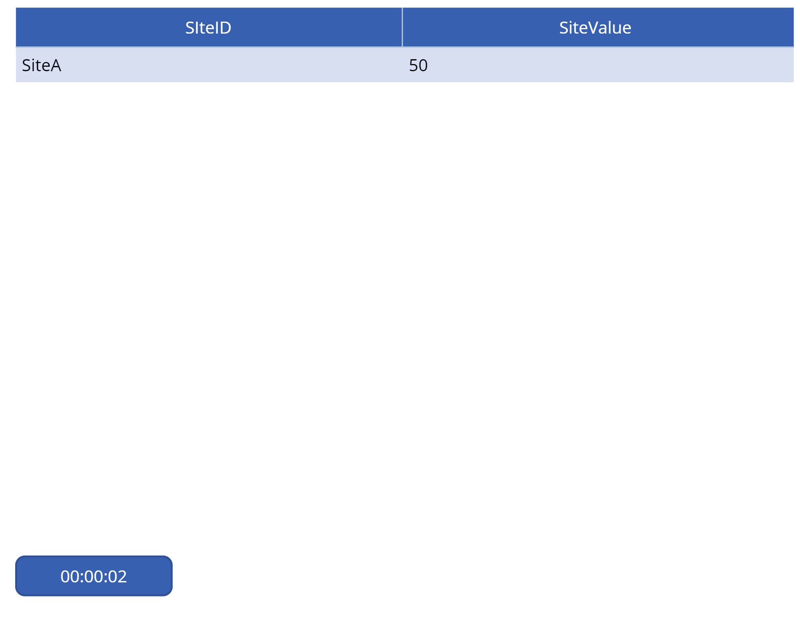

There are 3 applications: 

* **Realtime Site Value View**: a report application of PowerApps to show the site value

* **Site App**: an App to manage the Site value. 

* **User Permission App**: an application of PowerApps to manage the user permissiom.  

Azure Active Directory is to manage the user profile.

## Data Schema
The Azure SQL table of **UserPermission**. It has two columns, one is **UserEmail** and the other is **SiteID**, one record of the table stands for a user with the email has the site permission.

```sql
CREATE TABLE [dbo].[UserPermission] (
	[ID] [int] IDENTITY(1,1) NOT NULL,
	[UserEmail] [varchar](64) NOT NULL,
	[SiteID] [varchar](50) NOT NULL,
    CONSTRAINT [PK_UserPermission] PRIMARY KEY CLUSTERED ([ID] ASC)
)
```

The Azure SQL table of **Sites**. It has two columns, one is **SiteID** and the other is **SiteValue**.

```sql
CREATE TABLE [dbo].[Sites](
	[ID] [int] IDENTITY(1,1) NOT NULL,
	[SIteID] [varchar](50) NOT NULL,
	[SiteValue] [int] NOT NULL,
    CONSTRAINT [PK_Sites] PRIMARY KEY CLUSTERED ([ID] ASC) 
)
```

## Site App - PowerApps
Firstly, we will create an App with PowerApps so that we can input data of sites.

1. Login to [azure portal](https://portal.azure.com) and create an Azure SQL, and then create the Sites table with SQL script above.

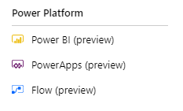


2. Click the **PowerApps (preview)** and click the button of "Create an app". 

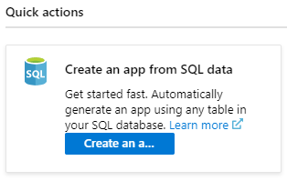

3. Input the correct informaton of the **Sites** table and App name. Click the button of "Create". 

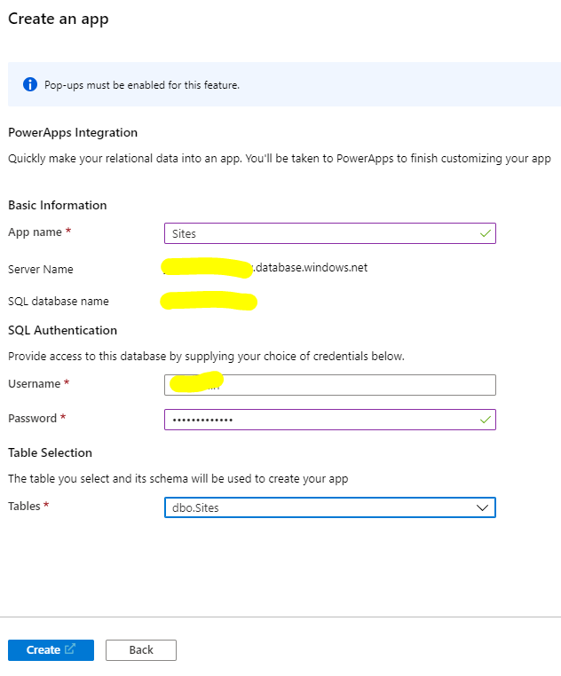

4. After a few seconds, A PowerApp created, and use it to input some sample data. 

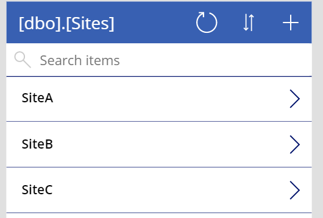

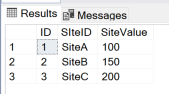

## User Permission App - PowerApps
1. Input the correct informaton of the **UserPermission** table and App name. Click the button of "Create". 


2. Now you can manage the user permission with this PowerApp to add or modify the records as below.


## Realtime Site View App - PowerApps

### 1. Create a new App of PowerApps and create a new Azure SQL as data source with the correct Azure SQL database information.


### 2. Select table and columns.


### 3. The table shows the data of the table

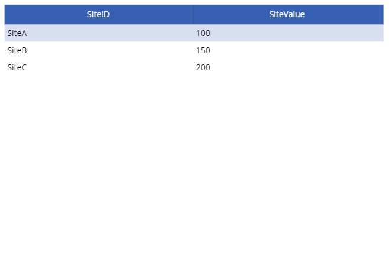

### 4. **Implement the role based security**

Add 2 variables in the App

```
Set(MyEmail, User().Email);
Set(MySite, Filter('[dbo].[UserPermission]', UserEmail=MyEmail).SiteID);
```

The expression **User().Email** can get the current user's email. And save it into variable named **MyEmail**.

Use variable **MyEmail** to filter the table **[dbo].[UserPermission]** and save the results of **SiteID** collection into variable **MySite**.

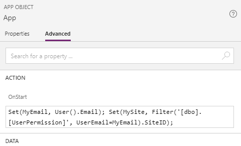

Change the table items with the code below:
```
Sort(Filter('[dbo].[Sites]', SiteID in MySite), SiteID, SortOrder.Descending)
```
It filters the data of **Sites** table with **MySite** collection

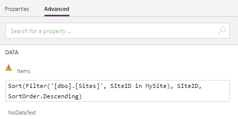

Now the role basd security is applied.

### 5. Create a timer to implement "realtime" data fetching  

Add a Timer and put the code below into **OnTimerStart** event.  

```
Refresh('[dbo].[Sites]');
Refresh('[dbo].[UserPermission]');
UpdateContext({MySite: Filter('[dbo].[UserPermission]', UserEmail=MyEmail).SiteID});
```

And set **Duration** as 5000 and **Repeat** as true. Then save the app and publish. Use Site App and UserPermission App to change the data you will see the screen captures as below.


The SiteView.msapp is [here](./SiteView.msapp).

## Site Report of Power BI

Here is a document from Power BI about row-level security.

https://docs.microsoft.com/en-us/power-bi/service-admin-rls

We will follow this document to complete the report.

Open Power BI Desktop and connect to the Azure SQL.

### 1. Merge the Sites and UserPermission table

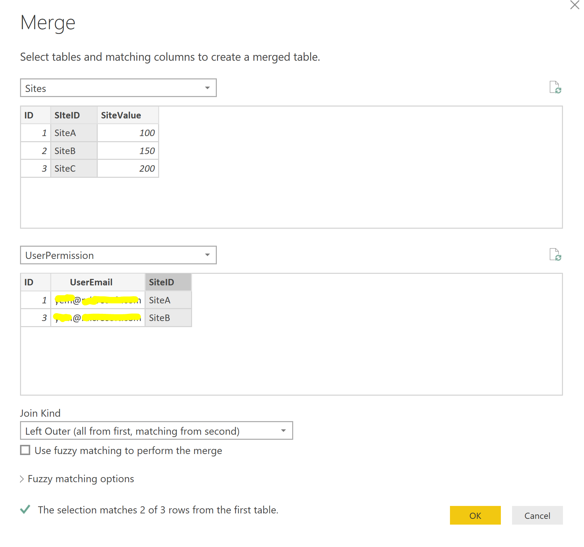

And We will have a new data as below. we can give a name to it such as "SitesAndUsrPerm".

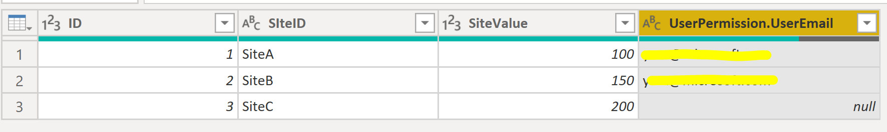

### 2. Crate a Report and Role

First we can create a simple report with a table as below

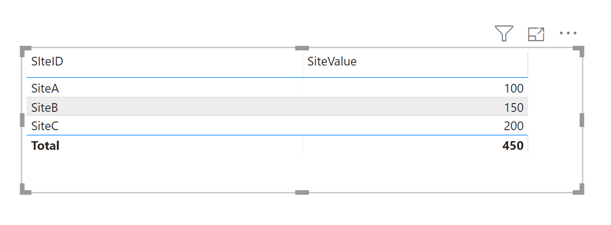

And then we need to create a role which can be named as "MySite" and it is a filter on the new merged table "UserSiteMapping". the expression is 
[UserSiteMapping.UserEmail] = userprincipalname(). 
It select the records based on the user email.

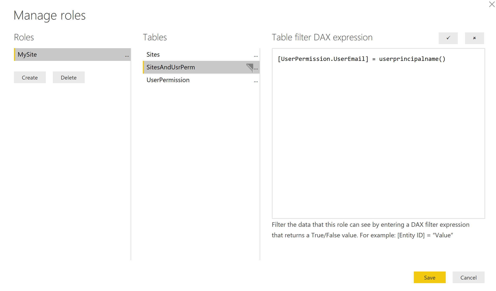

Turn on the role of "MySite" in Power BI Desktop.

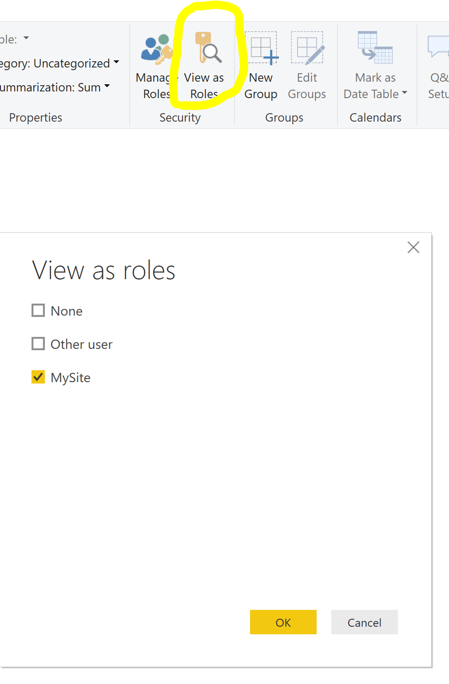

It only shows "SiteA" and "SiteB", as "SiteC" is not allow to access.


### 3. Publish Report to PowerBI.com

After publishing the report to PowerBI.com. you can add user under the role.

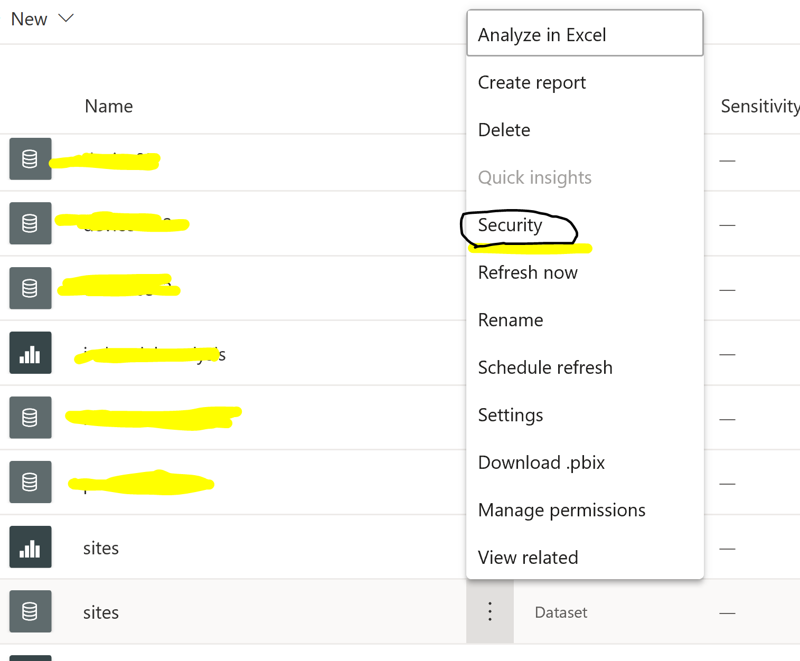

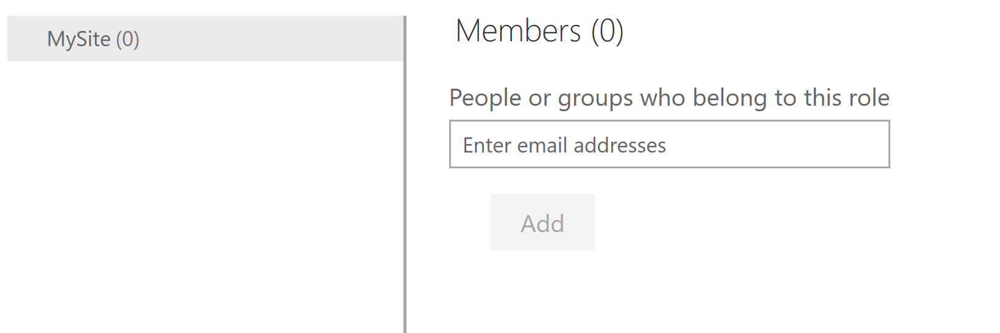

And then the user with the roles and have releated records in the table of "UserPermission". He will see correct records.

The sites.pbix is [here](./sites.pbix).
